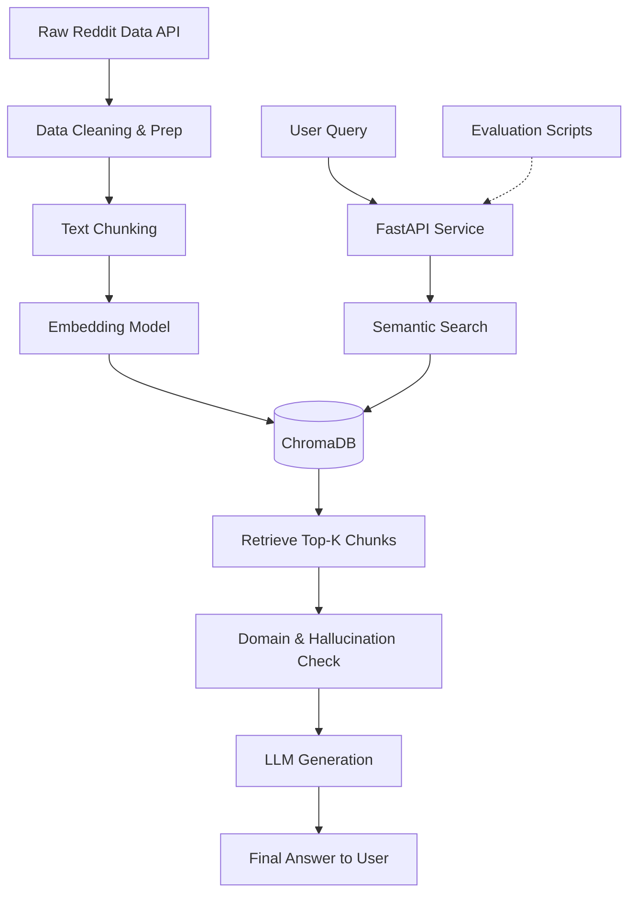

# End-to-End Reddit RAG & NLP Pipeline

Welcome to the comprehensive documentation for the Reddit RAG & NLP Pipeline internship project. This repository contains a fully functional semantic search and Retrieval-Augmented Generation (RAG) system built from scratch, operating on real-world Reddit data.

---

## 🏗️ Architecture Overview

The pipeline executes a full lifecycle from raw data ingestion to an evaluated API endpoint. Below is a high-level representation of the architecture:



1. **Raw Data**: Posts and comments are scraped using the Arctic Shift API from `r/artificial`.
2. **Cleaning**: Data is deduplicated, and formatting, links, and bot spam are stripped.
3. **Chunking**: Text is recursively broken down using paragraph, sentence, and word boundaries.
4. **Embeddings**: Chunks are embedded via `SentenceTransformers` (`all-MiniLM-L6-v2`).
5. **ChromaDB**: Embeddings and metadata are persisted for semantic retrieval.
6. **FastAPI**: A robust REST API wraps the retrieval and generation logic.
7. **LLM Generation**: OpenRouter serves the generation and hallucination checks.
8. **Evaluation**: Comprehensive precision/recall and generation latency metrics.

---

## 🚀 Setup & Run Instructions

This project is built to run cleanly in Google Colab or any standard Jupyter Python environment.

### 1. Install Requirements
The exact dependencies used for this run are pinned in the provided `requirements.txt`.
```bash
pip install -r requirements.txt
python -m spacy download en_core_web_sm
```

### 2. Getting the Data
The scraping logic is contained entirely in the early cells of `Intership(Project)_(7).ipynb`. Running the notebook sequentially will dynamically fetch the necessary datasets via the Arctic Shift API (which doesn't require Reddit Developer credentials).
- *Note: In this execution, the dataset targets `r/artificial` for the month of June 2026. Processed data is cached locally as `posts_progress.json` and `comments_progress.json`.*

### 3. Running the Pipeline
The notebook is built chronologically by week. Execute `Intership(Project)_(7).ipynb` sequentially from top to bottom.
- **Week 1-2**: Handles data ingestion, cleaning, NLP corpus statistics, chunking, and ChromaDB vector generation.
- **Week 3-4**: Initializes the LLM generation, domain constraints, and hallucination checks.
- **Week 5-6**: Spins up the FastAPI endpoints and executes the formal evaluation suites.

**Starting the API Server manually:**
In the notebook, the FastAPI service spins up on a background thread on port `8001`. If extracted to a standalone script, you can run it via:
```bash
uvicorn app:app_v2 --host 0.0.0.0 --port 8001
```

**Running Tests:**
Unit tests are encapsulated in `test_api.py`.
```bash
pytest test_api.py -v
```

---

## 📊 Evaluation & Benchmarks

The system was formally evaluated on a hand-labeled test set of 8 distinct queries against our real chunk data. The raw JSON artifacts for these metrics (`eval_retrieval_results.json` and `eval_generation_results.json`) are included in the repo.

### Retrieval Performance (Precision@K & Recall@K)
- **K=3**: Precision: 0.708 | Recall: 0.863
- **K=5**: Precision: 0.525 | Recall: 0.938
- **K=10**: Precision: 0.325 | Recall: 1.000

### Generation Quality & Latency Summary
- **Grounded rate**: 10/10 (100% of answers successfully traced back to valid chunks).
- **Domain-detection accuracy**: 100.0% (Properly rejected unrelated questions).
- **Average Latency**: ~835.5ms per query (Retrieval: ~25.1ms, Generation: ~810.4ms).

---

## 💡 Example Queries & Output

**1. Valid In-Domain Query**
**Request:** `POST /ask`
```json
{
  "query": "is AI going to replace software developers and programmers"
}
```
**Response:** `200 OK`
```json
{
  "answer": "While some fear job displacement, the consensus in the data suggests AI will act more as an advanced co-pilot, handling boilerplate code and repetitive tasks, allowing developers to focus on higher-level architecture and problem-solving.",
  "in_domain": true,
  "hallucination_check": "GROUNDED",
  "timing": {
    "retrieval_ms": 25.1,
    "domain_check_ms": 1.2,
    "generation_ms": 810.4,
    "hallucination_check_ms": 310.0,
    "total_ms": 1146.7
  }
}
```

**2. Out-of-Domain Rejection**
**Request:** `POST /ask`
```json
{
  "query": "how do I bake a chocolate cake"
}
```
**Response:** `200 OK`
```json
{
  "answer": "This question doesn't appear to be related to the dataset.",
  "in_domain": false,
  "timing": {
    "retrieval_ms": 24.3,
    "domain_check_ms": 1.1,
    "total_ms": 25.4
  }
}
```

---

## 🎬 Demo Video Recording Script

If you are recording a showcase of this project, follow this 5-step script for a smooth demonstration:

1. **Start the FastAPI server:** Run the notebook cells down to the `uvicorn.run()` thread. Show the output log confirming `New server (v2) running on port 8001`.
2. **Hit `/ask` with a sample query:** Open a terminal or use a notebook cell to run a `requests.post()` against `http://localhost:8001/ask` using an in-domain query like *"how to spot AI generated text"*.
3. **Show the response + latency:** Point out the JSON response structure. Highlight the `hallucination_check: GROUNDED` field and the detailed latency breakdown in milliseconds.
4. **Show pytest passing:** Run `!pytest test_api.py -v` in the cell and showcase the terminal output confirming **7/7 tests passed**, specifically noting the `test_500_downstream_failure` mock test.
5. **Show the eval JSON results:** Briefly open `eval_retrieval_results.json` and `eval_generation_results.json` in your file explorer to prove the evaluation scripts successfully generated physical artifact files with the precision, recall, and latency metrics.
